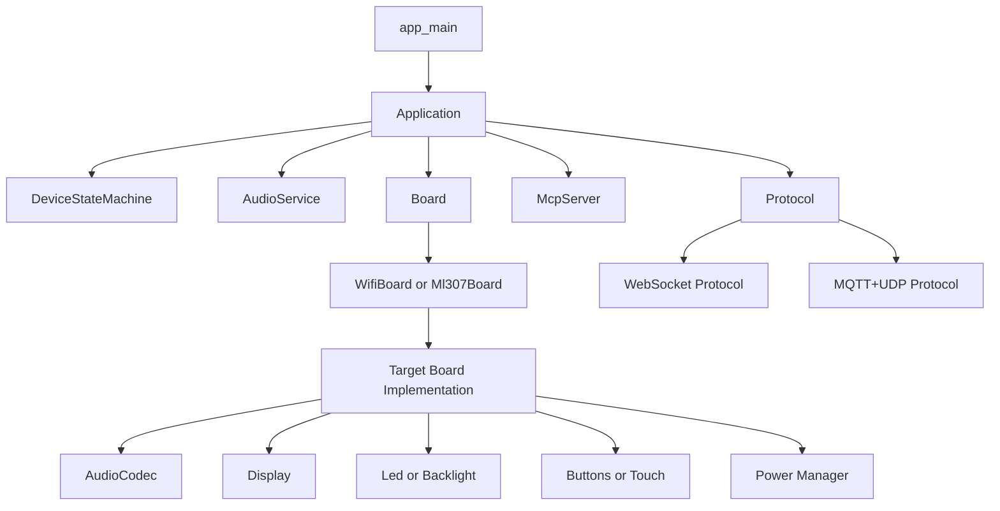
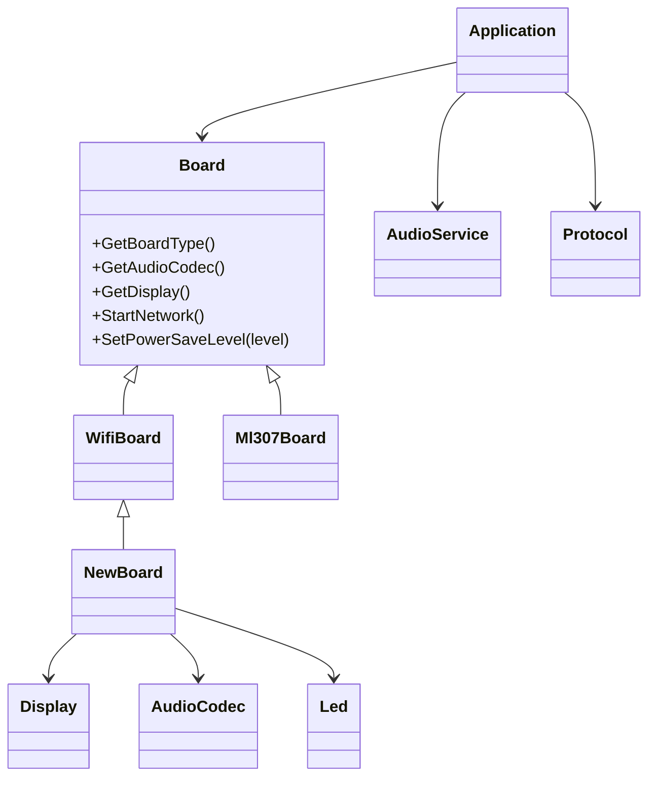
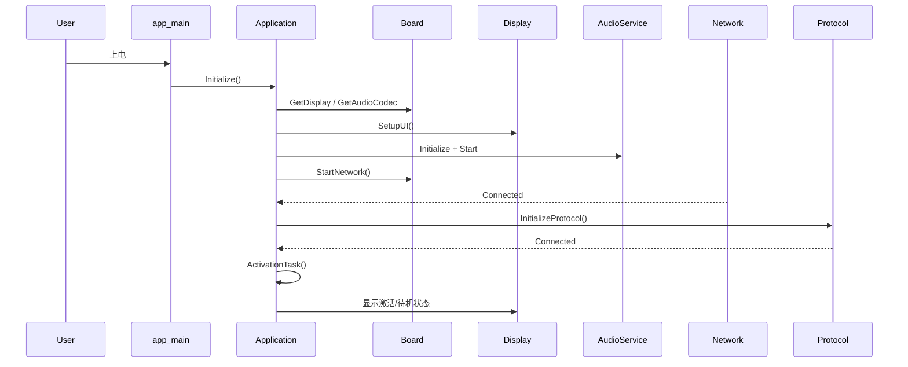
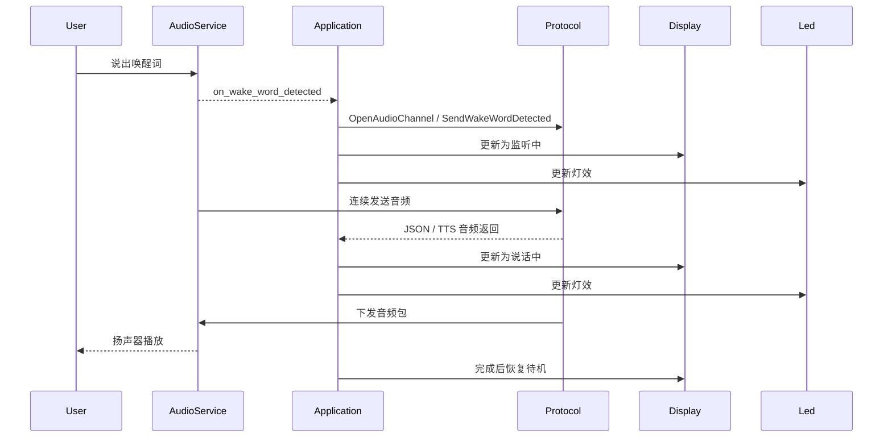

# 方案文档

## 2026-04-21 当前硬件移植与交互优化总体方案

### 1. 设计原则

- 以“先移植稳定，再优化体验”为主线，禁止把阶段 A 与阶段 B 混做。
- 优先复用现有公共模块，目标板实现尽量收敛在 `main/boards/<new-board>/`。
- 以板级适配隔离硬件差异，以 `Application` 统一编排业务状态。
- 对硬件不明确部分采用占位设计，不在公共层引入面向单板的特判。
- 任何涉及 OTA、分区、板型识别的配置，必须保持独立。

### 2. 当前软件架构理解

基于现有代码，系统可以抽象为以下五层：

1. 启动与系统层
   - `main/main.cc`
   - NVS 初始化、应用入口。
2. 业务编排层
   - `main/application.*`
   - `main/device_state_machine.*`
   - 负责状态切换、事件调度、协议和音频协同。
3. 能力服务层
   - `main/audio/*`
   - `main/protocols/*`
   - `main/mcp_server.*`
   - `main/display/*`
4. 板级抽象层
   - `main/boards/common/*`
   - `Board / WifiBoard / Ml307Board`
5. 目标板实现层
   - `main/boards/<board-name>/`
   - `config.h` / `config.json` / `README.md` / `*_board.cc`

### 3. 目标板接入架构

建议为当前硬件新增独立板型目录，采用以下结构：

```text
main/boards/<new-board>/
|- config.h
|- config.json
|- README.md
`- <new_board>.cc
```

设计要求：

- 若当前硬件使用 Wi-Fi，则继承 `WifiBoard`。
- 若当前硬件使用 ML307 4G，则继承 `Ml307Board`。
- 若同时支持多网络形态，应优先先做单一稳定版本，再评估多构建配置。

### 4. 分层职责

#### 4.1 板级适配层职责

- 定义 GPIO/I2C/SPI/I2S 等引脚。
- 初始化显示、按键、灯、音频、触摸、电源管理等硬件。
- 提供 `GetAudioCodec()`、`GetDisplay()`、`GetLed()`、`GetBacklight()`、`GetBatteryLevel()` 等实现。
- 负责网络接入启动与网络事件上报。
- 提供板级 JSON 描述和设备状态 JSON。

#### 4.2 业务编排层职责

- 管理设备状态机。
- 处理唤醒、开始监听、停止监听、播报中断、升级等全局流程。
- 协调音频链路与协议链路。
- 将网络状态同步到 UI 与设备状态。

#### 4.3 公共能力层职责

- 音频服务：采集、VAD、唤醒词、Opus 编解码、回放。
- 协议服务：会话建立、音频上传、JSON 指令、MCP 消息。
- 显示与灯效：状态栏、表情、弹窗、聊天消息。
- 持久化：NVS 配置、设备标识、用户设置。

### 5. 模块关系图



### 6. 类关系图



注：

- 上图中的 `NewBoard` 表示当前项目将新增的目标板实现。
- 若后续确认网络为蜂窝网络，则 `NewBoard` 改为继承 `Ml307Board`。

### 7. 核心接口设计

#### 7.1 板级接口

板级实现必须重点补齐以下接口：

- `GetBoardType()`
- `GetAudioCodec()`
- `GetDisplay()`
- `GetLed()`
- `GetBacklight()`
- `StartNetwork()`
- `SetNetworkEventCallback()`
- `GetBatteryLevel()`
- `GetBoardJson()`
- `GetDeviceStatusJson()`
- `SetPowerSaveLevel()`

#### 7.2 配置接口

目标板目录必须提供：

- `config.h`
  - 硬件资源定义。
  - 引脚宏和显示参数。
  - 电源控制相关参数。
- `config.json`
  - `target`
  - `builds[].name`
  - `builds[].sdkconfig_append`

建议初始配置：

- `target = esp32s3`
- Flash 大小按 `16MB`
- 根据资源情况选择合适分区表
- 若启用 PSRAM，则在目标构建配置中显式声明

### 8. 核心流程时序图

#### 8.1 上电启动到激活完成



#### 8.2 唤醒到对话播放



### 9. 迁移实施方案

#### 9.1 阶段 A：硬件移植实施顺序

1. 建立目标板目录和编译配置。
2. 补齐基础硬件资源定义：
   - 芯片目标
   - Flash / PSRAM
   - 下载方式
   - 电源和复位
3. 打通最小启动链路：
   - 系统启动
   - 串口日志
   - 显示初始化
   - 按键输入
4. 打通网络链路：
   - Wi-Fi 配网或蜂窝注册
   - 设备联网状态上报
5. 打通音频链路：
   - 麦克风采集
   - 扬声器播放
   - 采样率和声道校验
6. 打通协议链路：
   - 会话建立
   - 音频上传和回放
   - 设备激活
7. 打通状态反馈：
   - 屏幕
   - LED
   - 按键 / 触摸
8. 完成 OTA、异常恢复、低电量等边界验证。

#### 9.2 阶段 B：交互优化实施顺序

1. 梳理关键用户路径：
   - 待机
   - 唤醒
   - 聆听
   - 思考
   - 播报
   - 中断
   - 异常
2. 统一显示文案与视觉反馈。
3. 统一灯效和音效反馈策略。
4. 优化长响应、弱网、识别失败等场景的可解释性。
5. 针对目标硬件特性补充专属交互能力。

### 10. 测试设计

#### 10.1 单元测试建议

- 状态机合法跳转校验。
- 设备配置读写校验。
- 板级 JSON / 状态 JSON 输出合法性。

#### 10.2 集成测试重点

- 上电启动稳定性。
- 网络重连稳定性。
- 音频录播闭环。
- 长对话稳定性。
- 升级后配置保留与 OTA 正确性。

#### 10.3 边界测试

- 无网络。
- 配网失败。
- 音频设备初始化失败。
- 显示屏初始化失败。
- 云端连接中断。
- 低电量 / 充电状态切换。

### 11. 风险与对策

| 风险 | 说明 | 对策 |
| --- | --- | --- |
| 硬件信息不完整 | 当前仅有原理图，缺少结构化引脚表和器件清单 | 先完成文档和适配框架，编码前补一版硬件映射表 |
| 误复用已有板型 | 会导致 OTA 和构建标识混乱 | 创建独立板型目录与构建名称 |
| 音频外设差异大 | 编解码器、MIC、功放方案未确认 | 先参考最接近板型，确认器件后再固化驱动 |
| 显示驱动不匹配 | 面板 IC、触摸 IC 未知 | 抽离显示初始化为独立步骤，先做无 UI 验证 |
| 移植阶段过度优化 | 导致问题定位困难 | 严格分阶段推进 |

### 12. 当前结论

- 当前最优路径不是立即改公共逻辑，而是先建立新板型适配方案。
- 当前文档足以作为下一步“创建目标板目录并开始硬件映射”的输入。
- 在补齐器件型号和引脚表后，即可进入具体编码实现阶段。
